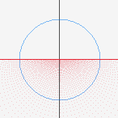
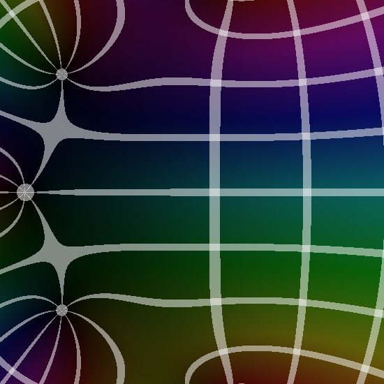
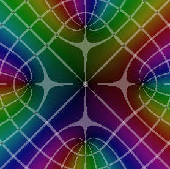
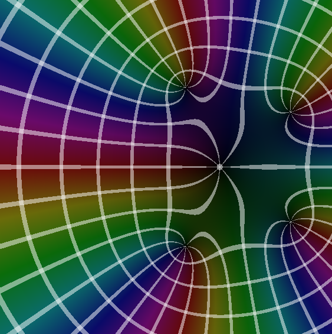
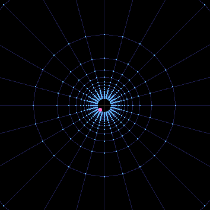

# complex analysis visualizations

hands-on, realtime visuals for core ideas in complex analysis. built in c with raylib. welcoming to poke, tweak, and learn from.

## gallery

<p align="center">
  <br/>
  <em>bilinear: circle-to-half-plane</em>
</p>

<p align="center">
  <br/>
  <em>series: exponential taylor approx</em>
</p>

<p align="center">
  <br/>
  <em>coloring: fifth power z minus z</em>
</p>

<p align="center">
  <br/>
  <em>series: log taylor approx</em>
</p>

<p align="center">
  <br/>
  <em>conformal: radial lines, reciprocal</em>
</p>

## current visualizations

### domain coloring
located in `coloring/`. domain coloring for complex-valued functions: hue = phase, brightness = magnitude.

features:
- Multiple complex functions (exp, sin, tan, reciprocal, polynomial)
- Phase and modulus lines
- Adjustable contrast and saturation
- Anti-aliasing options
- Pan and zoom interface

### conformal mappings
located in `conformal/`. watch grids morph under mappings.

features:
- Various input graph types (rectangular grid, concentric circles, radial lines, polar grid)
- Multiple mapping functions (identity, square, reciprocal, exponential, Möbius)
- Animated transitions between domains
- Mouse tracking to visualize individual point mappings

### bilinear transformations
located in `bilinear/`. möbius maps: (az+b)/(cz+d).

features:
- Visualization of circle and line preserving properties
- Mapping the unit disk to the upper half-plane
- Interactive input type selection

## suggested additions

### complex series visualization
visualize how taylor and laurent series approximate complex functions with increasing terms.

### riemann surfaces
represent multi-valued functions like sqrt or log as riemann surfaces.

### complex integration
visualize contour integration and the residue theorem with interactive paths.

### complex dynamical systems
explore julia sets, the mandelbrot set, and basins of attraction for newton's method.

### branch cuts
interactive visualization of branch cuts and riemann sheets.

## build & run

### prerequisites
- a c compiler (clang/gcc)
- raylib and pkg-config

macos (homebrew):
```bash
brew install raylib pkg-config
```

### compile (repo root)
build all apps:

```bash
mkdir -p bin
for d in bilinear coloring conformal series; do \
  cc "$d/main.c" -std=c11 -o "bin/$d" $(pkg-config --cflags --libs raylib); \
done
```

### run
```bash
./bin/bilinear
./bin/coloring
./bin/conformal
./bin/series
```

### recreate the gallery shots
- bilinear → input: unit circle, transform: circle to half-plane
- series → function: exp, split or error view; increase terms
- coloring → function: z^5 - z (cycle with ←/→)
- series → function: log, taylor/laurent view
- conformal → input: radial lines, mapping: reciprocal

## controls

controls show in-window. common:
- mouse drag: pan
- mouse wheel: zoom
- arrows: change function/input
- space: toggle animation

## license
mit — see LICENSE.
